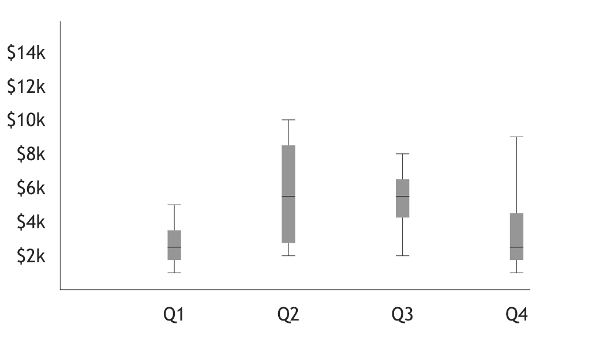

# VictoryBoxPlot

Mostly just followed along with this, but used VictoryBoxPlot instead, as well as newer React formatting and syntax

https://formidable.com/open-source/victory/docs

# Result

    

